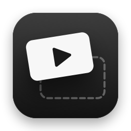
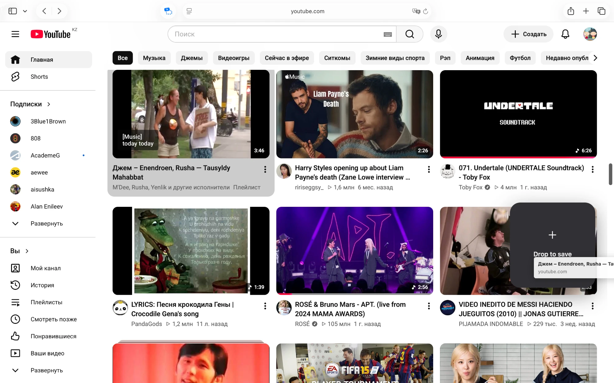
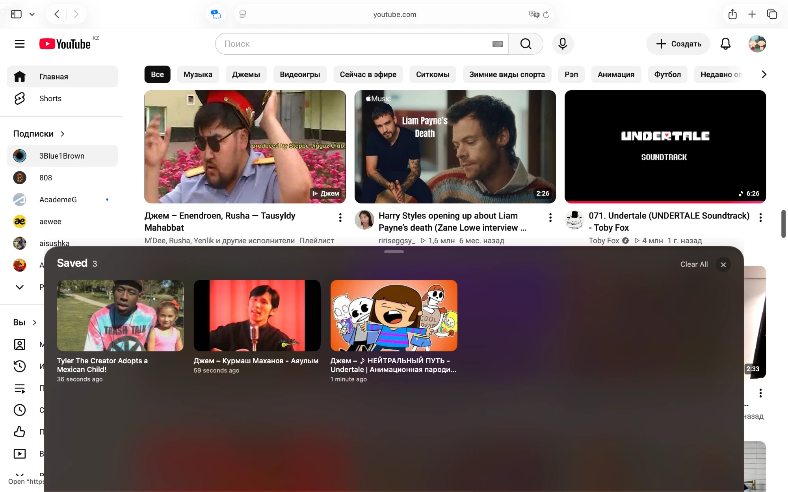

<p align="center">
  
</p>

<h1 align="center">DragTube</h1>

<p align="center">
  Save YouTube videos in Safari by dragging them — then pull up your list with a single key.
</p>

<p align="center">
  
  
</p>

## What it does

DragTube is a Safari extension for macOS that turns "I'll watch this later" into one gesture.

- **Drag to save.** Start dragging any video on YouTube — a thumbnail, a title, a link — and a drop zone slides in on the right. Let go on it and the video is saved. No need to open the video or select anything.
- **Press 5 to see them.** A native SwiftUI sheet with Liquid Glass rises from the bottom edge of the screen with all your saved videos.
- **Click to watch.** The video opens right in the tab you're on.

## Usage

| | |
|---|---|
| **Save a video** | Drag any video on YouTube onto the drop zone. |
| **Save from elsewhere** | Drag a YouTube link from another tab, the address bar or another app onto a YouTube page. |
| **Open your saved videos** | Press **4**, **5** or **6** (number row or keypad), or click the DragTube toolbar button. |
| **Watch** | Click a video — it opens in the current tab. |
| **Remove** | Hover a video and click ✕, or use **Clear All**. |
| **Close the sheet** | Press 4 / 5 / 6 again, press Esc, or click anywhere else. |

> On YouTube, 4 / 5 / 6 normally jump to 40 / 50 / 60 % of the video. DragTube takes those keys over; they still type normally in the search box and comments.

## How it works

Safari extensions can only show native UI inside the toolbar popover, so the floating sheet lives in the DragTube app that ships with the extension. When the extension opens it, the app runs as a quiet background helper: no Dock icon, and Safari stays the active app.


1. **`script.js`** runs on youtube.com. It shows the drop zone while you drag, works out the video ID and title, and listens for 4 / 5 / 6.
2. **The extension** (`SafariExtensionHandler`) saves videos to storage shared with the app (an App Group) and opens the app with `dragtube://saved`, without bringing it to the front.
3. **The app** shows `SavedSheetView` in a borderless, non-activating panel (`SheetPanel`) docked to the bottom of the screen.
4. **Clicking a video**: only the extension can control Safari tabs, so the app leaves the video ID in the App Group and sends a notification. The extension picks it up and navigates the current tab. If the extension doesn't answer within a second, the app opens the video in a new Safari tab instead.

Missing titles are fetched from YouTube's public oEmbed endpoint (no API key needed).

## Requirements

- macOS 26 Tahoe or later (the sheet uses Liquid Glass)
- Safari
- Xcode 26 to build

## Building

1. Open `DragTube.xcodeproj` in Xcode.
2. Under **Signing & Capabilities**, choose your own team for both the **DragTube** and **DragTube Extension** targets.
3. The App Group is tied to the Team ID. Replace `5BK3H6Y47F.org.raiymbek.DragTube` with `<YourTeamID>.<your.bundle.id>` in:
   - `DragTube/DragTube.entitlements`
   - `DragTube Extension/DragTube_Extension.entitlements`
   - `Shared/AppGroup.swift`

   If you change the bundle identifiers, also update `extensionBundleIdentifier` in `DragTube/ViewController.swift`.
4. Run the **DragTube** scheme. A small window explains how to turn the extension on.
5. In Safari, open **Settings → Extensions**, enable **DragTube Extension** and allow it on youtube.com.
6. Reload any open YouTube tabs.

If you build without a paid developer team ("Sign to Run Locally"), Safari also needs **Allow Unsigned Extensions** turned on in its developer settings.

## Project structure

```
DragTube/                     The app: setup window + the saved-videos sheet
  AppDelegate.swift           Normal app when you open it, background helper when the extension does
  SheetPanel.swift            Floating panel docked to the bottom edge; open/close logic
  SavedSheetView.swift        The sheet's SwiftUI interface (Liquid Glass, video grid)
DragTube Extension/           The Safari extension
  script.js, style.css        Runs on YouTube: drop zone, toast, 4/5/6 keys
  SafariExtensionHandler.swift  Messages from the page and the toolbar button
  AppBridge.swift             Opens the sheet; opens clicked videos in the current tab
Shared/                       Compiled into both
  VideoStore.swift            The saved list (App Group storage)
  OpenRequest.swift           App → extension "open this video" hand-off
  AppGroup.swift              Shared storage location
```

## Privacy

- Your saved list stays on your Mac, in DragTube's App Group container. No accounts, no analytics.
- The extension only has access to youtube.com.
- The only network requests go to YouTube: oEmbed for missing titles, and `i.ytimg.com` for thumbnails.

## Development notes

- The extension opens the app itself, so it doesn't need to run under the debugger. If ⌘R in Xcode leaves the app paused, uncheck **Product → Scheme → Edit Scheme… → Run → Debug executable**.
- Add `-debugPresentSheet` to the scheme's launch arguments to open the sheet as soon as the app starts, which is handy while working on its design.
- Debug builds log sheet events to `~/Library/Group Containers/<App Group ID>/sheet-debug.log`.
